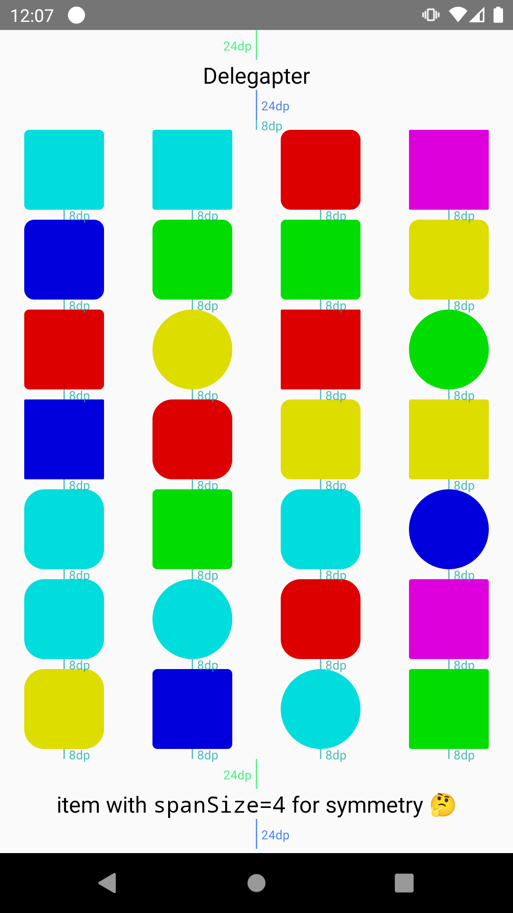

Yet another adapter delegate library.

```groovy
repositories {
    ...
    maven { url 'https://jitpack.io' }
}

...

dependencies {
    implementation("com.github.Miha-x64:Delegapter:742956d0")
}

```

### Why?

The idea of registering a delegate for a certain item type is flawed:
* one could forget to register a delegate (runtime crash),
* or to unregister a useless one (dead code);
* having items of the same type with different `viewTypes` and `ViewHolder`s is impossible.

The concept of this library is to make everything clear and explicit. No binding a delegate to certain item type, no fallback delegates.

### ViewHolder

We use our own ViewHolder class (called just `VH`) for a bunch of reasons:
* `RecyclerView.ViewHolder` is abstract, but it's sometimes necessary to create a “dumb” holder without any special fields or behaviour, thus `VH` is `open`
* There's `RecyclerView.ViewHolder.itemView: View`, but `VH` is generic, and has a property `VH<V, …>.view: V`
* When using viewBinding, all `ViewHolder`s look the same: they have `binding` field. `VH` supports an attachment of any type which is typically `ViewBinding`: `VH<*, B, …>.binding: B`
* Delegapter needs to tie certain `ViewHolder` type with the corresponding data type for type safety: `VH<V : View, B, D>`
* Therefore, `VH<*, *, D>` has its own `bind(D)` method which is a common practice (but not forced by the library)

There's a lot of factory functions for creating ViewHolders:
```kotlin
VH(TextView(parent.context).apply {
    layoutParams = RecyclerView.LayoutParams(MATCH_PARENT, WRAP_CONTENT)
    fontRes = R.font.roboto
    textSize = 17f
}, TextView::setText) // VH<TextView, Nothing?, CharSequence>

inflateVH(parent, ItemUserBinding::inflate) { user: User ->
    imageLoader.load(user.photo).into(photoView)
    nameView.text = user.name
} // VH<View, ItemUserBinding, User>

// and more…
```

### Delegate

Delegate is just a ViewHolder factory:
```kotlin
typealias Delegate<D> = (parent: ViewGroup) -> VH<*, *, D>
```
`VH::V` and `VH::B` are actually implementation details of a certain `VH`, Delegapter does not need them after instantiation, thus `<*, *`.

A typical Delegate declaration looks like this:
```kotlin
val userDelegate = "user" { parent: ViewGroup ->
    inflateVH(…) { … }
}
```

The string before lambda makes it go through library's `String.invoke(lambda)` function to make it named for debugging purposes. (Unfortunately, `tagged@ { lambda }` has no effect on `toString()`.)

Of course, plain lambdas are accepted, too. And `::function` references are also OK and named on their own.

### Delegapter

Delegapter is basically a list of (item, delegate) tuples, but their type agreement is guaranteed, like it was a `List<<D> Pair<D, Delegate<D>>` (non-denotable type in Java/Kotlin). 

Delegapter is not an `Adapter` itself, just a special data structure. Let's use `DelegatedAdapter` for convenience, it already has `val data = Delegapter(this, …)` property inside:

```kotlin
class SomeAdapter : DelegatedAdapter() {

    init { stateRestorationPolicy = … }

    fun update(item: Data) {
        data.clear()
        data.add(item.header, headerDelegate)
        data.addAll(item.recommended, recommendationDelegate)
        data.addAll(item.posts, postDelegate)
        // use autocomplete to see all available functions
    }

}
```

You may want to use `Delegapter` with a custom adapter in some advanced usage scenarios:
* Insert items not handled by `Delegapter` (headers, footers, ads 🤮).
  (Instead of passing `this` to the constructor, use custom `ListUpdateCallback` implementation to correct `notify*()` calls)
* Filter out some items without removing them
  (this requires a corrected `ListUpdateCallback`, too)
* Use several Delegapters in a single Adapter (IDK why but this should happen at some point)

In order to share `RecycledViewPool` between several `RecyclerView`s, you need to preserve the same `viewType` to `Delegate` mapping across adapters. This can be achieved using a shared “parent” `Delegapter`:

```kotlin
val delegapterFather = Delegapter(NullListUpdateCallback)

…

class SomeAdapter : RecyclerView.Adapter<…>() { // for custom adapter
    private val d = Delegapter(this, delegapterFather)
    …
}
val otherAdapter = DelegatedAdapter(delegapterFather) // using pre-baked adapter
```

Apart from skeletal `VHAdapter` and ready-to-use `DelegatedAdapter`, there are two more: `RepeatAdapter` and `SingleTypeAdapter`. They don't use Delegapter but employ `VH` and `Delegate` for the ease of reuse.

### DiffUtil

In order to use `DiffUtil`, you need to call `replace { }` function on a `Delegapter` instance:

```kotlin
data.replace {
    add(...)
}
```

A temporary instance of `Delegapter` subclass will be passed to the lambda. Its mutation API is quite similar but requires all your delegates to be `DiffDelegate`. Apart from implementing this interface directly (which is boring) there are two more ways:
```kotlin
val someDelegate = "some delegate" { … }.diff(
  areItemsTheSame = equateBy(SomeItem::id), /*
  areContentsTheSame = Any::equals,
  getChangePayload = { _, _ -> null },
*/)


val otherDelegate = "otherDelegate" { … } + object : DiffUtil.ItemCallback() {
    override fun are...TheSame(...) = ...
}
```

### SpanSizeLookup

This utility is super simple:

```kotlin
layoutManager = GridLayoutManager(context, spanCount, orientation, false).apply {
    spanSizeLookup = delegapter.spanSizeLookup { position, item, delegate ->
        if (delegate == wideDelegate) spanCount else 1
    }
}
```

### ItemDecoration

Decorating different viewTypes is a stressful job. Here's how Delegapter helps you to add spaces and dividers for items of certain types:

```kotlin
data.decor(RecyclerView.VERTICAL) {
  // keep 16dp after header, before user
  between({ it === headerDelegate }, { it === userDelegate }, size = 16)

  // keep 30dp between any two users
  between({ it === userDelegate }, size = 30)
  
  // text units for text items!
  between({ it === textDelegate }, size = 16, unit = COMPLEX_UNIT_SP)

  // dividers
  after({ it === titleDelegate }, size = 1, drawable = ColorDrawable(Color.BLACK))

  // dividers with spaces
  after(
    { it === titleDelegate },
    size = 5,
    drawable = GradientDrawable().apply {
      setColor(Color.BLACK)
      setSize(0, dp(1))
    },
    drawableGravity = Gravity.CENTER_VERTICAL or Gravity.FILL_HORIZONTAL,
  )
}
```

Predicates like `{ it === headerDelegate }` look clumsy but are very flexible because you can check for several conditions there, for example, match any type (`{ true }`) or check for external conditions (`{ useTextSpaces && it === textDelegate }`).

`Drawable` will receive `state` and `alpha` from the `View` it belongs to. `bindingAdapterPosition` (or `-1 - layoutPosition`, if the former is not available) will be passed to `Drawable` as `level`.

Note: strictly speaking, `between()` means “attach decoration _after previous_ matching item if _next_ item matches”. Thus, if you're adding new item, you need to `notifyItemChanged(previousItemIndex, anyDummy)` to make this decoration appear.

One more precaution: `.decor()` doesn't know which `LayoutManager` you use. With Grid one, it's your responsibility to mind about rows and columns.


### Debugging

Any tool can make you happy until it works fine. And make you hate your job when something gets screwed up. A virtue of any abstraction level is an ability to peek into and see what actually happens. If you feel sad, just pass some booleans around: `decor(orientation, debugDelegates = true, debugSpaces = true)`. This will show you which delegate is used for each item (that's where having named lambdas helps!), or highlight spaces (as on the screenshot).


